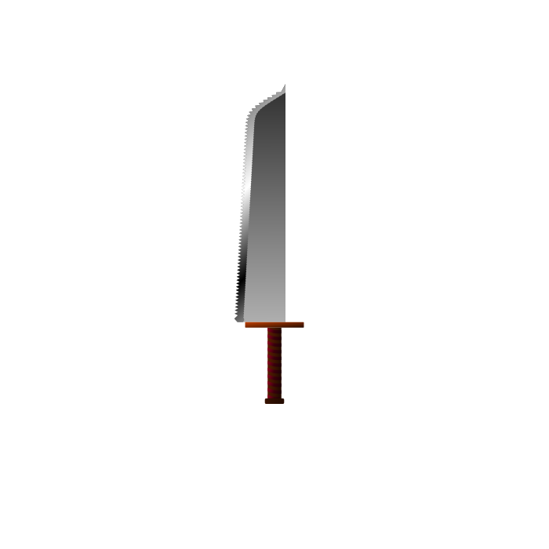
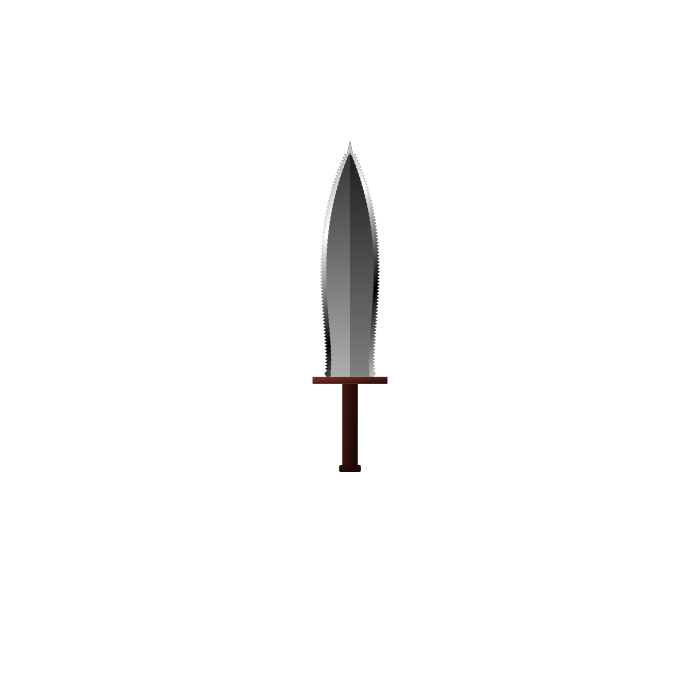
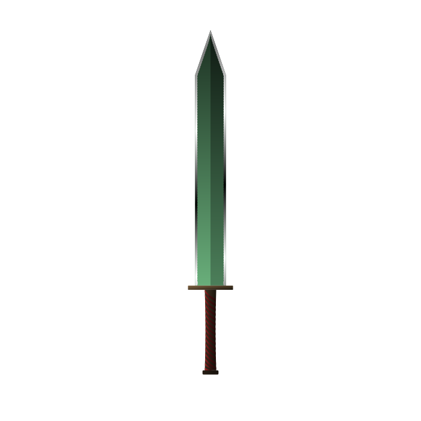
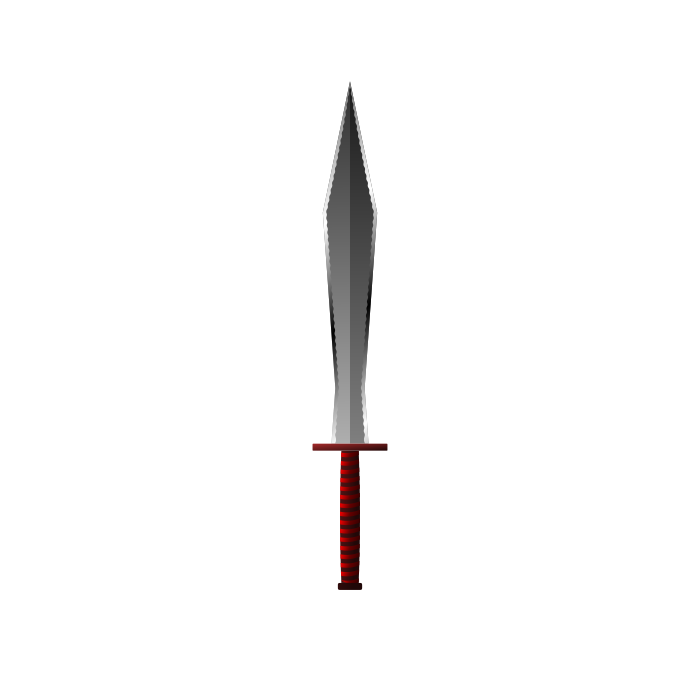
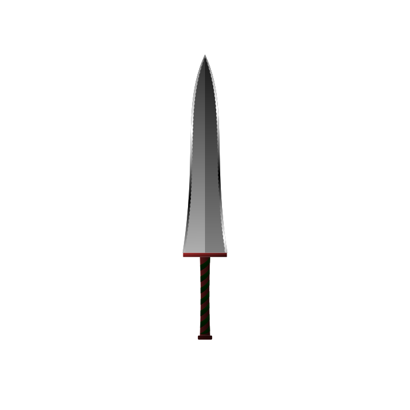
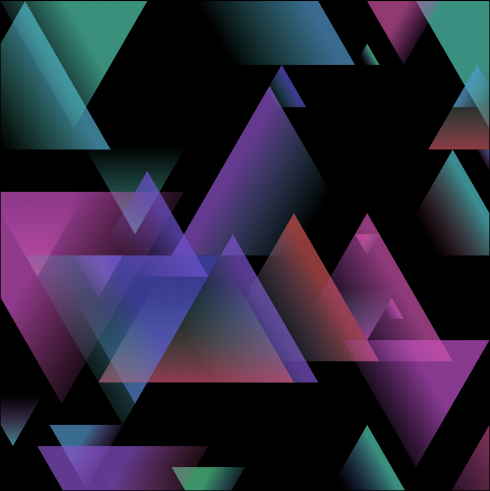
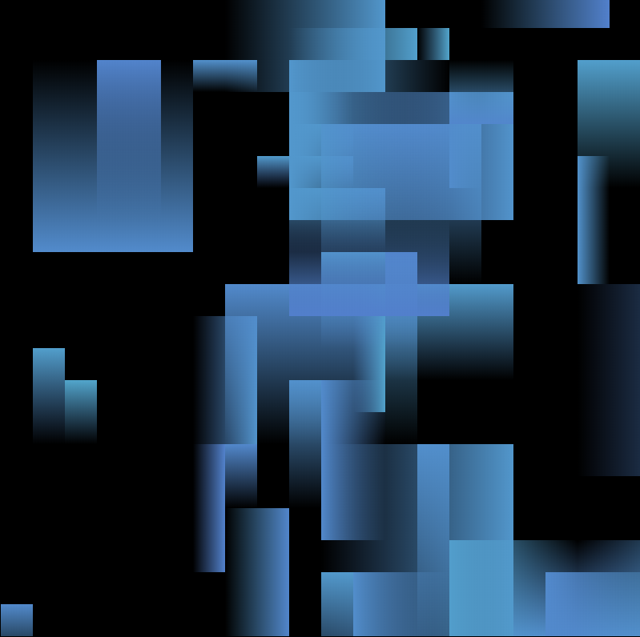

# Sid's Procedural Artwork projects

## Procedural Rectangular Abstract art
[Live Demo](https://dattasid.github.io/rects_div.html)

This was an experiment in generating procedural art, that was random yet that humans would find them interesting. My theory was that images that contain patterns, repetition and symmetry would capture human attention. Hence this program randomly subdivides rectangles, and assigns them color. Sometimes the two subdivisions are copies of each other, adding repetition. Sometimes they are mirrors of each other, adding symmetry. Sometimes, the program will introduce "errors" in the copy, hopefully making it interesting.

Did it become art? Judge for yourself at the live demo!

 

## Procedural Cityscapes
[Live Demo](https://dattasid.github.io/cityscape-1.html)

Created for Reddit's r/proceduralgeneration Cityscape challenge, this program draws dark brooding (evil?) buildings against a moody evening sky. The building can be rectangular, or polygonal, with varying window light patterns.

 

## Procedural Seascapes
[Live Demo](https://dattasid.github.io/fish.html)

Created for Reddit's r/proceduralgeneration Seascape challenge, this program draws a coral reef and procedural fish with a pixel art aethetic.

 

## Procedural insects
[Live Demo](https://dattasid.github.io/ProcInsect.html)

Created for Reddit's r/proceduralgeneration Procedural Creature challenge, this program creates insects with segmented body, legs and antenna. The body segments will have the familiar spiky squiggly edges that we love to hate. The body segments should appear very similar to each other in spite of varying in legth and width, so that the whole insect appears one consistent creature.

 

## Procedural Swords
[Live Demo](https://dattasid.github.io/procsword.html)

Created for Reddit's r/proceduralgeneration Procedural Weapon contest, This program creates swords with procedural blades and hilts. The blades can be a variety of shapes, and the hilts can have a variety of patterns. Curves sword were planned but could not be completed.

 

## Geometric shapes
[Live Demo](https://dattasid.github.io/geom-design-1.html)

Simple rectangles or triangles with gradient. 

 

## Procedural Jewelry descriptions
[Live Demo](https://dattasid.github.io/ProcJewelry.html) [Project](https://github.com/dattasid/ProcGrammar)

Procedural jewelry descriptions. Created a rule based system for this as usual text replacement systems were not enough. This system allows rules to be fired based on previously chosen values in random generation. For example, if a person is wealthy their jewelry will be more elaborate and may contain expensive materials. For a ruler the program will generate a crown.

Some examples:

>Lagir is a fisherman. He is wearing a necklace. 
>The necklace is a strand of straw shell beads. The copper pendant is engraved with an image of an ox and a temple.

>Afuz o'Surepuje is a magician. She is wearing a necklace and two rings. 
>The necklace is a strand of ruby beads. The pendant is engraved with alchemical symbols for earth, Mercury and amalgama. 
>The ring is made of silver. On it are inscribed the alchemic symbols for Jupiter, water, mercury and Venus. It has a barely perceiptible black glow. 
>The ring is made of silver. The centerpiece of the ring is a garnet. The piece has filigree and milgrain detail. It has a gloomy black glow. 

>Yaroja h'Fadoyel is a ruler. He is wearing a crown, a ring and a necklace. 
>The silver crown is adorned with 185 sapphires and emarlds. On it is inscribed the motto "Knowledge, Merit and Salvation". 
>The ring is made of gold. The centerpiece of the ring is a sapphire. It is accented by twelve leaf shaped ambers and diamonds around it in a round shape. The piece has delicate filigree detail. 
>The necklace is a strand of ruby beads. The pendant is set with ambers and diamonds. 
